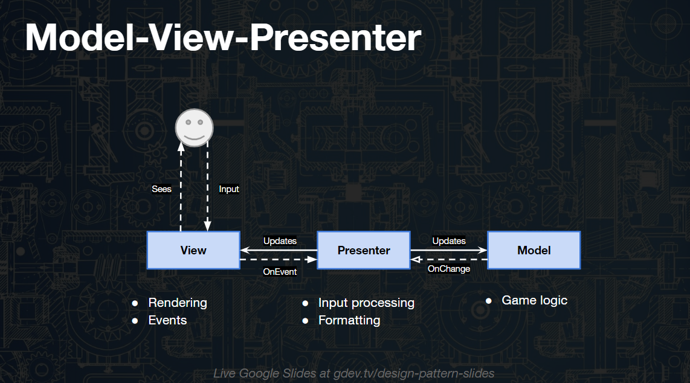

- [空间划分算法](#空间划分算法)
  - [二元空间划分(binary space partition)](#二元空间划分binary-space-partition)
  - [入口](#入口)
  - [包围体层次结构（BHV）](#包围体层次结构bhv)
  - [八叉树](#八叉树)
- [可见性算法](#可见性算法)
  - [潜在可见集(potentially visible set)](#潜在可见集potentially-visible-set)
  - [遮挡剔除（occlusion culling）](#遮挡剔除occlusion-culling)
- [游戏AI](#游戏ai)
  - [群组行为](#群组行为)
  - [感知系统](#感知系统)
  - [行为树](#行为树)
  - [FSM有限状态机](#fsm有限状态机)
- [寻路](#寻路)
  - [如果设计Astar寻路导航系统，如何做,注意哪些点？](#如果设计astar寻路导航系统如何做注意哪些点)
  - [导航网格](#导航网格)
- [MVC](#mvc)
- [游戏系统](#游戏系统)
  - [技能系统](#技能系统)
  - [任务系统](#任务系统)
    - [Fungus](#fungus)


# 空间划分算法

## 二元空间划分(binary space partition)
是一种3D空间划分算法，以初始空间和离线计算时间换取更高的运行速度。BSP将一组多边形作为输入，通过一种递归算法，创建一个二叉树结构。
- 能够按照正确的从前到后或从后到前的顺序遍历多边形。
- 还可以进行碰撞检测或大规模的剔除操作。

访问二元查找树（BST）中每个节点的查找时间都是线性的O(n)，因为这可以简化为一个线性堆栈问题。查找单个关键字的复杂度为O(log2n)。

BSP的局限性：
- 游戏世界必须是半静态的
- 不适合包含大量移动物体的游戏

BSP的应用：
- BSP零重绘策略：给定任何视点，BSP树可用于确定场景中一组静态多边形从后到前的准确渲染顺序。 按照从前到后而不是从后到前的顺序遍历BSP树，对于每个访问到的多边形，屏蔽到屏幕的数据写入，将多边形用作模板缓存。本质上和Z缓存没什么区别。使用更聪明的方式---扫描线渲染。

- 将BSP树用作剔除：
 > 背面剔除
 >
 > 视景体剔除：给定观察方向，如果从视点看不到前面（或后面）的某个分割面，则不但可以剔除该分割面，还可以剔除它后面（前面）的整个子树。

 - 将BSP用于碰撞检测
确定碰撞面后，快速遍历BSP树找到这样一个子节点：物体位于其凸性子空间中。找到满足条件的叶节点后，便可根据BSP节点的几何形状来检测是否已经（或将要）发生碰撞，方法是扩大包围体或沿法线向量移动BSP节点（沿法线方向将分割面往前推），直到发生碰撞为止。

## 入口

入口是一种实时的PVS实现技术。

## 包围体层次结构（BHV）

另一种对物体或几何体进行分组，实现快速碰撞检测或剔除的方法。包围体大多选择球体或与坐标轴平行的立方体。

使用N叉树结构。

## 八叉树
八叉树是一种特殊的BHV树，以平行于坐标轴的平面将每个BHV节点划分成8个子节点。每个节点大小相同，形状为立方体。

仅当节点包含物体或多边形时，才进一步对其划分。

# 可见性算法

## 潜在可见集(potentially visible set)
给定任何视点，都有一个从该视点可能看到的多边形列表。

实现这种理念的方法有很多，BSP，八叉树等等。

## 遮挡剔除（occlusion culling）
如果不使用PVS或者PVS不可用，不使用有关可见性的静态解决方案（游戏世界变化频繁，PVS、BSP和八叉树等不适合），但是场景中有重要的几何元素，它们很大而且会遮挡大部分场景，可以使用遮挡剔除。

创建一个遮挡体（occlusion volume），位于该遮挡体内的物体全都不可见。可以对BSP树，物体，八叉树节点等进行检测。

# 游戏AI

[Unity人工智能AI编程知识](https://blog.csdn.net/qq_39574690/article/details/80958838)

## 群组行为
模拟鸟群行走或人群行走过程的称之为群组行为

分散 、队列 、 聚集

## 感知系统
视觉

听觉

## 行为树

[Unity使用Behavior Tree的小小心得](https://blog.csdn.net/qq_39574690/article/details/80219620)

包含四种节点。分别是action节点、组合节点、条件节点和修饰节点。

(1) Composites 组合节点，主要包含：Sequence顺序条件，Selector选择条件，Parallel平行条件以及他们之间相互组合的条件。

(2) Decorator 装饰节点，该节点只包含一个子节点，并未该子节点添加一些特殊的功能，如让子节点循环操作或者让子task一直运行直到其返回某个运行状态值，或者将task的返回值取反等等

(3) Actions 行为节点，行为节点是真正做事的节点，其为叶节点。Behavior Designer插件中自带了不少Action节点，如果不够用，也可以编写自己的Action。对于自己编写的行为状态，一般都是需要添加自己的

(4) Conditinals 条件节点 ，用于判断某条件是否成立。目前看来，是Behavior Designer为了贯彻职责单一的原则，将判断专门作为一个节点独立处理，比如判断某目标是否在视野内，其实在攻击的Action里面也可以写，但是这样Action就不单一了，不利于视野判断处理的复用。一般条件节点出现在Sequence控制节点中，其后紧跟条件成立后的Action节点。

## FSM有限状态机

[Unity手游实战：从0开始SLG——独立功能扩展（一）用反射实现游戏状态机](https://zhuanlan.zhihu.com/p/83385476)

FSM是一种数据结构，它由以下几个部分组成：

    1，内在的所有状态（必须是有限个）
    2，输入条件
    3，状态之间起到连接性作用的转换函数

为什么要用FSM？

因为它编程快速简单，易于调试，性能高，与人类思维相似从而便于梳理，灵活且容易修改

FSM的描述性定义：

一个有限状态机是一个设备，或是一个模型，具有有限数量的状态。它可以在任何给定时间根据输入进行操作，使得系统从一个状态转换到另一个状态，或者是使一个输出或者一种行为的发生，一个有限状态机在任何瞬间只能处于一种状态。

State 状态基类，定义了基本的Enter，Update，Exit三种状态行为，通常在这三种状态行为的方法里会写一些逻辑。每个State都会有StateID（状态id，可以是枚举等），FSMControl（控制该状态的状态控制器的引用），Check方法（用来进行状态判断，并返回StateID，通过FSMControl驱动）

FSMControl，包含了一下FSMMachine，封装层。

FSMMachine，驱动它的State列表，Update方法调用当前State的Check方法来获得StateID，当currentState的Check方法返回的StateID和当前StateID不同，则切换状态。

这是一个简单的FSM状态机系统，根据需要自己写个Control继承FSMControl来驱动状态。因为Check是State的职责，所以每一个不同对象的行为如Human的Idle和Dog的Idel区分肯定也不同。因此需要分别去写HumanIdleState和DogIdleState。如果还有Cat，Fish，可想而知代码量会有多么庞大。

因此我将FSMControl抽象为一个公共基类，把State的Check具体实现作为FSMControl的Virtual方法。这样在IdleState里的Check方法就不用写具体的状态切换判断逻辑，而是调用它FSMControl子类（自己写的继承自FSMControl的Control类）的重写方法

这样每次添加的新对象只要有Idle这个状态，就可以用一个公用的StateIdle，状态切换的逻辑差异放在Control层

# 寻路

## 如果设计Astar寻路导航系统，如何做,注意哪些点？

A*算法的工作方式和Dijkstra算法几乎一模一样，唯一的区别是对搜索边界上的点的开销的计算。被修正的到节点的开销F用来决定节点在优先队列中的位置。

>F = G + H

G是到达一个节点的累计开销。H是一个启发因子，它给出的是节点到目标节点的估计距离。

寻路系统一般不用我们纯手写的，这样会不太方便，我们开发中一般会直接使用
1. Unity自带的Navigation导航系统
2. 使用插件使用A* Pathfinding Project

## 导航网格

[RecastNavigation-NavMesh生成原理](https://blog.csdn.net/you_lan_hai/article/details/77428858)

（1）选择除了主角、目标以及摄像机、直线光以外的所有物体，在Inspector窗口的右上角勾选Static，称为静态物体，并设置为Navigation Static静态类型。
（2）在主窗口中选择[Window]→[Navigation]，打开Navigation窗口。该窗口用于生成路径寻找所需要的导航网格寻路，代理将根据该导航网格进行寻路计算。确保勾选了“Navigation Static”。点击Bake进行烘培。
（3）选择需要寻路的游戏对象，为它添加一个NavMeshAgent组件。
（4）编写寻路代码，新建一个脚本。
寻路代码：
```
//寻找的目标
public Transform TransHero;
private NavMeshAgent agent;
//找到场景中的NavMesh代理
agent=this.GetComponent<NavMeshAgent>();
if(agent&&TransHero)
{
    //使得代理不断寻找目标点的位置
    agent.SetDestination(TransHero.transform.position);
}
```

寻路节点，关卡设计师在游戏世界中摆放的角色可到达的位置。这些点被作为节点载入内存中。边通过点于点之间的组合自动生成。它最大的问题在于角色只能在节点和对应边缘移动。因此地图上会有许多不能走的镂空区域。为了更精确地描述这些区域，又需要添加大量的寻路节点，进而导致寻路算法花费的时间更长。

导航网格不存在上述问题，它通过凸多边形来表示节点，临近节点就是相邻的凸多边形。一般情况下，用远小于寻路节点数量的凸多边形就可以将游戏世界区域表示出来。而且由于封闭区域可以行走，因此返回的路径更加自然。

另一方面，A*是启发式优化寻路算法的统称，导航网格与其不在同一层级。无论是通过凸多边形还是网格，都是对地图信息的一种描述。拓扑这些信息后，可以用相同的算法运算，因此我们可以用A\*来实现Navigation。


# MVC

保持mvc的思想，不要遵循MVC框架。



[探讨：为什么在游戏开发中不使用MVC？](https://zhuanlan.zhihu.com/p/38280972)

[Unity手游实战：从0开始SLG——UI框架篇（一）各种UI框架模型简介（试读篇）](https://zhuanlan.zhihu.com/p/157273459)

再者，不管是框架还是设计模式都是为了解决实际问题的，不需要也不应该为了设计而过度设计，但是也不能完全没有章法，胡乱定义。

一个稳定的，有序的能满足项目需求的实现就是好的实现。切莫过度纠结设计模式和框架结构，但是也不能轻视这部分，够用就好，够用就好。

# 游戏系统

## 技能系统

[如何开发一个游戏技能编辑器？](https://www.zhihu.com/question/22920219)

[五：方便扩展的被动技能，Buffer系统（和编辑器）](https://zhuanlan.zhihu.com/p/38326478)

[Unity技能系统框架（二）技能抽象模块细化](https://blog.csdn.net/u010377179/article/details/105009793)

[DOTA2脚本编写](https://developer.valvesoftware.com/wiki/Dota_2_Workshop_Tools:zh-cn/Scripting:zh-cn#.E6.8A.80.E8.83.BD.E8.84.9A.E6.9C.AC)

## 任务系统

流程和实现分离

逻辑和数据分离

插件式

[任务设计入门——试着自己编辑一个任务！](https://www.jianshu.com/p/402c84c50d9e)

[简单聊聊游戏任务的基本设计流程](https://www.jianshu.com/p/7a6186ba1244)


### [Fungus](https://fungusgames.com/)

Our intuitive visual scripting lets everyone create beautiful story games - for free and with no coding! Power users can use Lua scripting to tackle bigger storytelling projects.